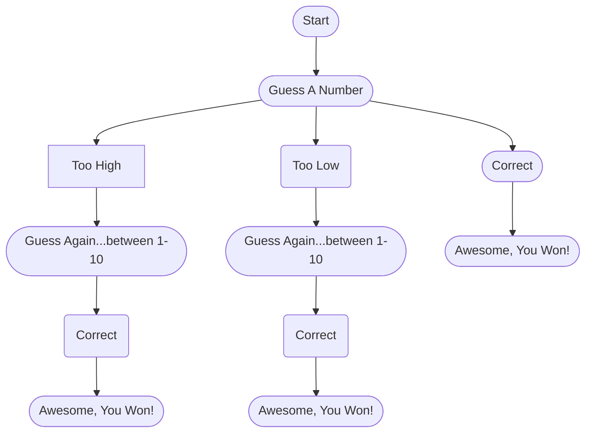

To start the game off the player has to guess a number.  If they guess correctly, then they have won.  If they guess too high, they will need to guess again with a hint to guess
between 1-10.  If they guess too low, then they will need to guess again with a hint to guess between 1-10 as well. Nothing is needed for letters because we are asking that they 
guess a number not a letter.  We can also have the flow chart wrap back up to B if they guess wrong to simplify the chart and add in other options.
